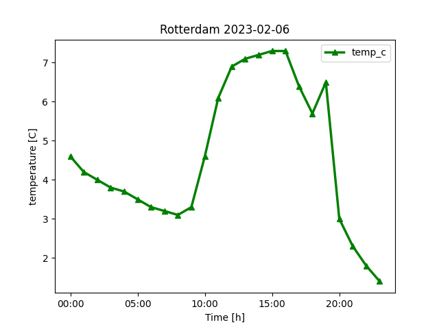

# Weather-forcast

## Introduction

With this code, we can get a graph describing the weather of a given day for a location of our choice.

## HOW-TO RUN

1. Prerequisite is to have python >= 3.9 installed.
2. Setup the environment
   1. Create virtual environment: `python3 -m venv .venv`
   2. Activate virtual environment: `source .venv/bin/activate`
   3. Install the dependencies: `pip3 install -r requirements.txt`
3. Register at https://www.weatherapi.com/ and take the KEY for using apis
4. Add the KEY to the environmental variables.
   1. In MAC-OS or Linux-OS it will be `export KEY="<YOUR KEY>"`
5. run the command: `python3 weather.py  --update_place <Location name> --plot`

